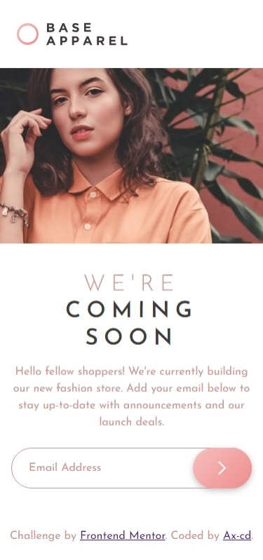
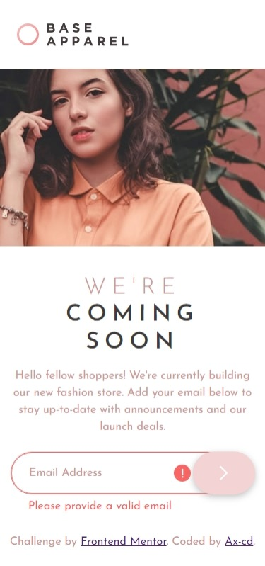
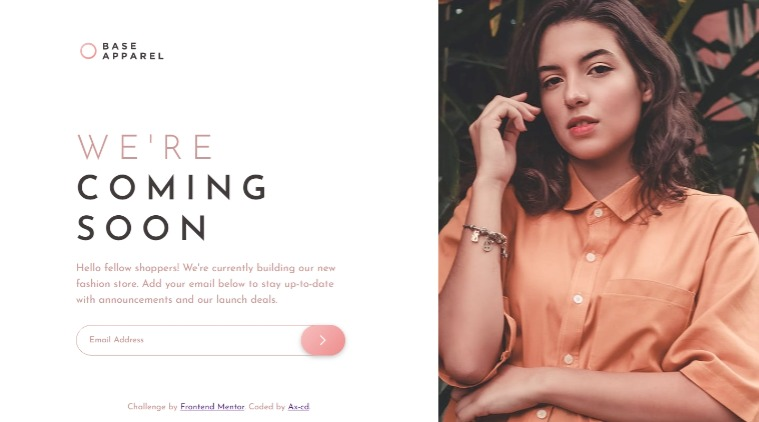
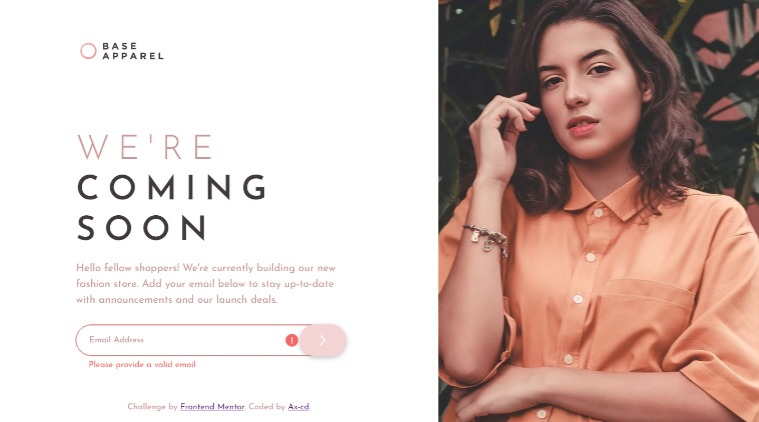

# Frontend Mentor - Base Apparel coming soon page solution

This is a solution to the [Base Apparel coming soon page challenge on Frontend Mentor](https://www.frontendmentor.io/challenges/base-apparel-coming-soon-page-5d46b47f8db8a7063f9331a0). Frontend Mentor challenges help you improve your coding skills by building realistic projects.

## Table of contents

- [Overview](#overview)
  - [The challenge](#the-challenge)
  - [Links](#links)
  - [Screenshot](#screenshot)
    - [Mobile design](#mobile-design)
    - [Desktop design](#desktop-design)
- [My process](#my-process)
  - [Built with](#built-with)
  - [What I learned](#what-i-learned)
  - [Continued development](#continued-development)
  - [Useful resources](#useful-resources)
- [Author](#author)

## Overview

### The challenge

Users should be able to:

- View the optimal layout for the site depending on their device's screen size
- See hover states for all interactive elements on the page
- Receive an error message when the `form` is submitted if:
  - The `input` field is empty
  - The email address is not formatted correctly

### Links

- Solution URL: [Frontend Mentor](https://www.frontendmentor.io/solutions/base-apparel-coming-soon-page-using-html-css-and-javascript-KZjpmUDJKS)
- Live Site URL: [GitHub Page](https://ax-cd.github.io/base-apparel-coming-soon-challenge/)

### Screenshot

#### Mobile design




#### Desktop design




## My process

### Built with

- Mobile-first workflow
- Semantic HTML5 markup
- CSS custom properties
- Flexbox
- CSS Grid

### What I learned

- CSS design system: At the beginning of this project, I used the 62.5% technique in order to resize the html. Only to find out later on that is wasn't ideal in terms of accessibility. Recently I started to watch the tutorial (linked below) on implementing a design system with CSS by Kevin Powell. And so I scraped off everything I had styled so far and started anew: the styling was done much more quickly.

- Sass and JavaScript don't work together like CSS and JavaScript: At first I intended to build this project with SASS/SCSS. However when it was time to work with JavaScript for the email validation, and add and remove the error classes, I found out it wasn't possible. After searching around, I finally decided to shift to plain CSS. I kept the Sass structure, folders and files, in the repository to keep tracks of my work.

```css
.error-input {
  background-image: url(/public/images/icon-error.svg);
  background-repeat: no-repeat;
  background-position: center right 5.5em;
  outline: 1px solid hsl(0deg, 93%, 68%);
}

.error-msg::after {
  content: "Please provide a valid email";
  color: hsl(0deg, 93%, 68%);
  position: absolute;
  top: 4em;
  left: 1.5em;
}
```

### Continued development

I aim to implement a design system for my future projects, to gain time and flexibility in my work. I also want to build those projects with accessibility for the users at the forefront of development.

### Useful resources

- ["Create a Design System with CSS" - freeCodeCamp.org](https://youtu.be/lRaL-8qZ0mM) - A useful web development course on YouTube.
- ["Responsive Images in CSS" by Chris Coyier, CSS-TRICKS](https://css-tricks.com/responsive-images-css/) - This article introduced me to the element <picture> and how to use it.

## Author

- GitHub - [Ax-cd](https://github.com/Ax-cd)
- Frontend Mentor - [@Ax-cd](https://www.frontendmentor.io/profile/Ax-cd)
- Instagram - [@ax.coding](https://www.instagram.com/ax.coding/)
